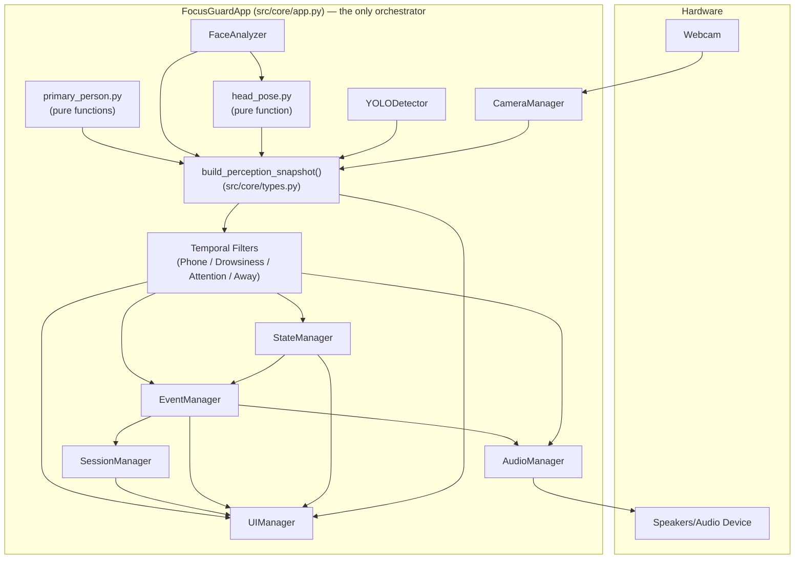
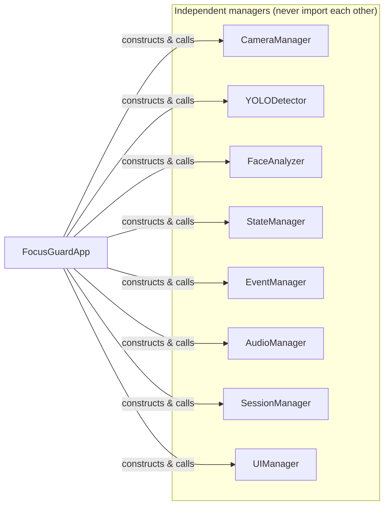

# FocusGuard Architecture

> Audience: a developer joining the project, an interviewer evaluating it, and the project owner revisiting it months later.

## Simple explanation

FocusGuard watches your webcam, figures out whether you're focused, distracted by your
phone, drowsy, looking away, or not at your desk, and shows you that live on screen
(with optional sound). It's built as a pipeline: a frame comes in from the camera, gets
analyzed by a few independent detectors, those raw readings get smoothed over time so a
single blurry frame can't cause a false alarm, a state machine decides one clear status,
and that status drives events, sounds, and a running session score.

## Technical explanation

FocusGuard is a single-process, synchronous, frame-by-frame pipeline. Each stage is a
small class with **one job**, communicating through plain, immutable data objects
(`Frame`, `Detection`, `PerceptionSnapshot`, `StateTransition`, `Event`,
`SessionSummary`). There is no framework, no message bus, no threads for the CV
pipeline — `FocusGuardApp` (`src/core/app.py`) is the only place that knows about all
the pieces and calls them in order, once per frame.

## High-level architecture

Every arrow above is a **method call from `FocusGuardApp`**, not a direct dependency
between the boxes — see [Dependency relationships](#dependency-relationships) below for
why that distinction matters.

## Major components and their single responsibility

| Component | File | Responsibility (and *only* that) |
|---|---|---|
| `ConfigManager` | `src/core/config_manager.py` | Load and validate `config/config.yaml` into typed, frozen dataclasses. |
| `CameraManager` | `src/camera/camera_manager.py` | Open/read/release the webcam. Nothing else. |
| `YOLODetector` | `src/detection/yolo_detector.py` | Load the YOLO model, run inference, filter to person/cell-phone detections. |
| `primary_person.py` | `src/detection/primary_person.py` | Pure functions: pick the largest person box, associate a phone box with it. |
| `FaceAnalyzer` | `src/face/face_analyzer.py` | Load MediaPipe Face Landmarker, run inference, compute eye-openness (EAR) and `EyeState`. |
| `head_pose.py` | `src/face/head_pose.py` | Pure function: landmarks → approximate yaw/pitch → `HeadOrientation`. |
| `build_perception_snapshot()` | `src/core/types.py` | Assemble one frame's raw outputs into an immutable `PerceptionSnapshot`, including `VisionQuality`. |
| `PhoneTemporalFilter`, `HeadOrientationFilter`, `DrowsinessFilter`, `PersonAwayFilter` | `src/state/*.py` | Turn one noisy raw signal into a temporally-confirmed boolean, each independently. |
| `DurationConfirmer`, `hysteresis()`, `Debouncer`, `Cooldown` | `src/state/temporal_filter.py` | The generic, reusable timing primitives the four filters above (and `AudioManager`, `EventManager`) are built from. |
| `StateManager` | `src/state/state_manager.py` | Turn the four filtered booleans + `VisionQuality` into one `FocusState`, deterministically. |
| `EventManager` | `src/events/event_manager.py` | Turn filter/state transition edges into `Event` records; keep a bounded log. |
| `AudioManager` | `src/audio/audio_manager.py` | Play warning sounds and music on request; own mute/volume/cooldown/persistent-reminder timing. |
| `SessionManager` | `src/session/session_manager.py` | Accumulate duration/streak/count statistics and a focus score from incoming transitions/events; persist a JSON summary. |
| `UIManager` / `dashboard_view.py` | `src/ui/*.py` | Render the Pygame dashboard and translate keyboard/window input into `UIAction`s. |
| `FocusGuardApp` | `src/core/app.py` | The **only** module that knows about all of the above. Wires them together, in the exact order below. |

## Dependency relationships

This is the part of the architecture that most determines how the codebase reads and
tests. **Every manager above is independently constructible and independently
testable** — none of them import each other. The only place that imports *everything*
is `src/core/app.py`.

### What should NOT depend on what (and doesn't, by inspection)

- **`AudioManager` never imports `EventType`, `FocusState`, or any other manager.** It
  exposes granular methods (`play_phone_warning()`, `notify_drowsiness()`, ...) and has
  no idea *why* it was called. This was a deliberate design decision (documented in the
  module's own docstring) so audio stays swappable/testable without dragging in the
  event or state-machine vocabulary.
- **`SessionManager` *does* import `FocusState` and `EventType`/`Event`** — this is the
  one manager that legitimately needs to know the vocabulary, because its entire job is
  deriving statistics from state/event history. This is a deliberate, documented
  exception to the "managers don't know about each other's types" rule, not an
  inconsistency.
- **`StateManager` never imports a temporal filter class.** It only accepts plain
  booleans (`is_away`, `is_phone_distraction`, ...) and a `VisionQuality` enum — it has
  no idea a `PhoneTemporalFilter` exists. This is what makes `StateManager` testable
  with 20-plus deterministic transition tests without ever touching YOLO or MediaPipe.
- **`EventManager` never imports `AudioManager` or `SessionManager`.** It only produces
  `Event` objects; `FocusGuardApp` is the one that decides to hand an `Event` to
  `SessionManager.record_event()` or to trigger a matching `AudioManager.play_*()`
  call.
- **None of the four temporal filters import each other.** `PhoneTemporalFilter` has no
  idea `DrowsinessFilter` exists. Each is a standalone confirm/clear state machine
  keyed off one boolean signal.
- **`UIManager` never imports `CameraManager`, `YOLODetector`, or any CV logic.** It
  only knows about `DashboardView` (a plain dataclass) and a raw `numpy` frame array.
  This is explicit in the PRD ("do not put CV logic inside the rendering code") and
  verified by `UIManager`'s tests never importing a single CV module.

## Dependency injection / testing seams

Every module that talks to something slow, flaky, or hardware-dependent takes that
dependency as an **injectable factory or backend**, defaulting to the real thing:

| Module | Real backend (default) | Injectable seam |
|---|---|---|
| `CameraManager` | `cv2.VideoCapture` | `capture_factory: Callable[[int], VideoCapture]` |
| `YOLODetector` | `ultralytics.YOLO(...)` | `model_factory: Callable[[str], ModelLike]` |
| `FaceAnalyzer` | MediaPipe `FaceLandmarker` | `landmarker_factory: Callable[[str], FaceLandmarkerLike]` |
| `AudioManager` | `pygame.mixer`, `pygame.mixer.music` | `mixer_backend`, `music_backend`, `sound_factory` |
| `UIManager` | real `pygame` display | run under `SDL_VIDEODRIVER=dummy` — no injection needed, Pygame itself provides a headless driver |
| `FocusGuardApp` | real instances of all the above | every manager can be passed pre-built (with its own fakes already wired in) via constructor keyword arguments |

This is why `tests/test_app.py` can test the **real** `FocusGuardApp` orchestration
logic — the actual production code path — against fake hardware, instead of mocking the
orchestrator itself. See [`TESTING.md`](TESTING.md) for how this plays out in practice.

## Runtime ownership

`FocusGuardApp` owns the lifetime of every manager: it constructs them in `__init__`,
opens/loads them in `_startup()`, drives them frame-by-frame in `_run_one_iteration()`,
and releases them in `_shutdown()` — which runs even if startup only partially
succeeded (every manager's release/shutdown method is itself safe to call multiple
times or before init). No manager manages its own lifecycle relative to another
manager.

## Why the architecture is structured this way

1. **One responsibility per class** means each one has a small, enumerable set of test
   cases (see the per-module test counts in [`TESTING.md`](TESTING.md)) instead of a
   combinatorial explosion of "what if the camera AND the model both do X" cases.
2. **No manager imports another manager** means any one of them can be deleted,
   replaced, or tested in total isolation. This was validated in practice: fifteen
   phases were built and merged incrementally, each phase touching only its own new
   file(s) plus `FocusGuardApp`'s wiring — no phase ever required "going back" to
   rewrite an earlier manager's internals (see [`PROJECT_EVOLUTION.md`](PROJECT_EVOLUTION.md)).
3. **Plain, immutable dataclasses as the only inter-module contract**
   (`PerceptionSnapshot`, `StateTransition`, `Event`, `DashboardView`) means there is
   never a question of "did this object get mutated somewhere downstream" — every
   value crossing a module boundary is frozen.
4. **Temporal filtering is a separate layer from detection and from the state
   machine**, not baked into either. This is what makes "never trust one frame"
   enforceable everywhere consistently instead of being a rule someone has to remember
   to apply case-by-case. See [`TEMPORAL_FILTERING.md`](TEMPORAL_FILTERING.md).

## Explain this to an interviewer in 60 seconds

> "FocusGuard is a real-time computer-vision app that watches your webcam and tells you
> whether you're focused, on your phone, drowsy, looking away, or away from your desk.
> The architecture is a strict pipeline: camera → YOLO for person/phone detection →
> MediaPipe for face landmarks and eye/head geometry → a set of independent temporal
> filters that turn noisy per-frame signals into confirmed conditions over time — so a
> single blurry frame never triggers a false alarm — → a priority-based state machine
> that picks one clear status → events → audio and a live dashboard. Every piece is a
> separate, independently-testable class with one job and no dependency on any other
> manager's internals; the only file that wires them all together is the app
> orchestrator. That's also why the whole thing has 660+ deterministic tests that run
> in about ten seconds with no webcam, GPU, or audio device attached — every hardware
> boundary is an injectable seam."

---

## Implementation vs Documentation Notes

This section exists because the task explicitly requires surfacing discrepancies
between the PRD, README, source code, and tests rather than silently picking one.
**None of these were "fixed" by writing this documentation — they are reported as
found.**

| # | Discrepancy | PRD/documented intent | Actual implementation | Does it matter? |
|---|---|---|---|---|
| 1 | **Phase numbering** | PRD §39 numbers phases 0–14 (Phase 0 = env, Phase 1 = structure/config, ..., Phase 14 = README/demo/polish). | The repository's actual branch/PR names (`feature/phase-0-...` through `feature/phase-13-...`) run one number *behind* the PRD's numbers for every phase after the first, because the repo's own "Phase 0" branch commit combined PRD's Phase 0 (environment) and Phase 1 (project structure/config) into a single foundational commit. Repo-local branch "Phase N" = PRD "Phase N+1" for all N ≥ 1. | No functional effect — purely a labeling offset, confirmed independently multiple times across phases via stub-file docstrings (which cite the *PRD's* numbers directly, e.g. `session_manager.py` said `"""...Implemented in Phase 11."""` matching PRD §39's own "Phase 11" label even while the branch that implemented it was named `feature/phase-10-session-manager`). See [`PROJECT_EVOLUTION.md`](PROJECT_EVOLUTION.md) for the full mapping. |
| 2 | **"Estimated Focus Score" label** | PRD §26 explicitly says the display text must be `ESTIMATED FOCUS SCORE`. | PRD §22's own dashboard mockup shows the label as `FOCUS SCORE` (no "ESTIMATED"), and the actual UI (`src/ui/ui_manager.py`, `_render_dashboard`) matches the §22 mockup exactly: `("FOCUS SCORE", str(view.focus_score), TEXT_COLOR)`. | Cosmetic only. This is a PRD-internal inconsistency (§22 vs §26 disagree with each other), not an implementation bug — the implementation faithfully matches one of the two PRD sections. Flagged during the SessionManager phase's own investigation and knowingly left as-is pending a product decision; never fixed. |
| 3 | **`camera.target_fps` config field has no effect** | Declared in PRD §30's config schema and loaded/validated by `ConfigManager`. | `CameraManager` never calls `cv2.CAP_PROP_FPS` or otherwise consumes `CameraConfig.target_fps` anywhere — it's parsed, validated, and then unused. | Real but minor. Changing this value in `config.yaml` currently does nothing. Flagged during the Performance phase's own investigation as an out-of-scope finding, never addressed. |
| 4 | **`yolo.detection_interval_seconds` config field** | PRD §29 permits ("may... run detection at controlled intervals") but PRD §30's literal config schema does not list this field. | Added during the Performance/Testing phase, justified by a real measured FPS shortfall (see [`PERFORMANCE.md`](PERFORMANCE.md)). | Not a contradiction — an extension within PRD's own stated allowance, just not present in the PRD's example YAML. |
| 5 | **Automatic JSON session-summary save** | PRD §25/§27 both describe JSON persistence as "optional" ("Use in-memory session data and **optionally** save a JSON summary"), implying a caller decision, not a hard requirement. | `SessionManager.save_summary_json()` itself is an explicit, separately-callable method (matching "optional" literally at the API level) — but `FocusGuardApp._end_session()` calls it **unconditionally** on every session end, with no config flag to disable it. | Minor. In practice, every completed session's JSON always gets saved to `logs/`; there is currently no way to opt out short of not calling the app normally. |
| 6 | **Persistent audio reminders are not in the PRD at all** | `FOCUSGUARD_PRD.md` §21 (Audio System) describes only one-shot warnings per condition and one cooldown value (`phone.warning_cooldown_seconds`). It has no concept of a *repeating* reminder for a sustained condition. | `AudioManager` implements `notify_phone_distraction()`, `notify_drowsiness()`, `notify_attention_diverted()` plus a new `audio.persistent_warning_interval_seconds` config field — a feature requested and built entirely after the PRD's V1 scope was complete and merged. | Not a contradiction of the PRD (it doesn't forbid this), but it is explicitly **outside** the original V1 specification. Documented fully in [`AUDIO_SYSTEM.md`](AUDIO_SYSTEM.md) and marked there as a post-V1 addition. At the time this documentation was generated, this feature exists on an **unmerged branch** (`feature/persistent-audio-reminders`), not yet on `main` — see the note at the top of [`PROJECT_EVOLUTION.md`](PROJECT_EVOLUTION.md). |
| 7 | **No AWAY-specific audio warning** | PRD §21's "Support:" list of six audio behaviors does not include an away-specific sound, and PRD §43 lists "improved phone/person association" etc. as V2, not this. | `AudioManager` has no `play_away_warning()` method and no away sound key; the persistent-reminder feature above was explicitly scoped to phone/drowsiness/attention only, per an explicit decision to defer AWAY audio (no filename was ever specified for it). | Not a discrepancy — correctly matches the PRD's own list. Noted here only so the absence reads as intentional, not an oversight. |
