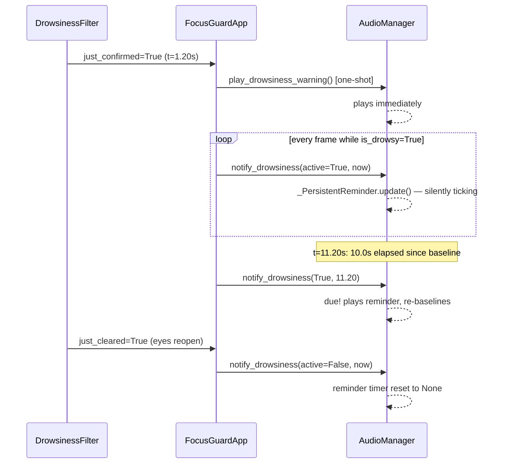

# The Audio System

Source: `src/audio/audio_manager.py`. `AudioManager` owns *only* audio (PRD §33): it
never imports `EventType`, `FocusState`, or any other manager — it exposes granular
methods and has no idea *why* it was called. `FocusGuardApp` is the one place that
decides when to call each method.

> **Scope note:** the *persistent reminder* mechanism described in this document (the
> "PERSISTENT CONDITION" half of it) is **not part of the original PRD**. It was added
> after FocusGuard V1 was already complete, as a separate, explicitly-requested
> feature, and — at the time this documentation was written — exists only on an
> unmerged branch (`feature/persistent-audio-reminders`), not on `main`. Everything
> else in this document (one-shot warnings, mute, cooldown, missing-file handling,
> music) is part of the original, merged V1.

## ONE-SHOT EVENT vs. PERSISTENT CONDITION — the core distinction

This is the concept this document exists to explain clearly, because the two
mechanisms look similar but solve different problems and use *different, independent*
timers.

| | ONE-SHOT EVENT | PERSISTENT CONDITION |
|---|---|---|
| Triggered by | A filter's `just_confirmed` edge (fires exactly once per confirmation) | The condition's **current, continuing** state, checked every frame |
| Method | `play_phone_warning()`, `play_drowsiness_warning()`, `play_attention_warning()` | `notify_phone_distraction()`, `notify_drowsiness()`, `notify_attention_diverted()` |
| Fires | Once, the instant the condition is confirmed | Repeatedly, every `audio.persistent_warning_interval_seconds` (default `10.0s`), for as long as the condition never clears |
| Governed by | `phone.warning_cooldown_seconds` (phone only — see below) | `audio.persistent_warning_interval_seconds` (shared across phone/drowsiness/attention) |
| Purpose | "Something just started happening" | "It's still happening — you haven't fixed it" |

### Worked example (your own scenario, exactly as implemented)

```text
DROWSINESS starts (eyes closed 1.20s, DrowsinessFilter confirms)
      │
      ├─► ONE-SHOT: play_drowsiness_warning() fires immediately  ("wake up")
      │
   0–10s → condition continues, no repeat (persistent-reminder timer just started its baseline)
      │
  ~10s  → notify_drowsiness() detects the interval has elapsed → fires again ("wake up")
      │
   condition continues
      │
  ~20s  → fires again
      │
  eyes reopen → DrowsinessFilter clears → reminder timer resets completely
      │
  next drowsiness episode starts a brand-new interval from zero
```



## Why this prevents audio spam

Two independent, deliberate mechanisms, layered:

1. **The temporal filter itself** only reports `just_confirmed` once per genuine
   confirmation (see [`TEMPORAL_FILTERING.md`](TEMPORAL_FILTERING.md)) — this alone
   already guarantees the one-shot warning can't fire every frame.
2. **`_PersistentReminder`** (a small private class inside `audio_manager.py`) tracks
   *when the condition became active* and only reports "due" once
   `persistent_warning_interval_seconds` has genuinely elapsed since the last
   reminder — never on every frame the condition happens to still be true.

On the very first frame a condition becomes active, `_PersistentReminder.update()`
records a baseline and returns `False` — it deliberately does **not** fire immediately,
because the one-shot warning already covered "the first alert." This is what prevents
the two mechanisms from double-firing at onset.

## `phone.warning_cooldown_seconds` vs. `audio.persistent_warning_interval_seconds`

These are easy to confuse because both default to `10.0` seconds, but they are
**unrelated, independent mechanisms** gating **different things**:

- `phone.warning_cooldown_seconds` gates the **event log entry** for repeated
  `PHONE_DETECTED` *confirmations* (i.e. rapid confirm → clear → reconfirm
  oscillation) — implemented in `EventManager`, reused via the generic `Cooldown`
  primitive.
- `audio.persistent_warning_interval_seconds` gates the **repeat reminder** for one
  *continuous, unbroken* confirmed condition — implemented entirely in
  `AudioManager`, via `_PersistentReminder`.

They don't call into each other. A phone reminder fires by calling `_play_sound()`
directly (bypassing `play_phone_warning()`'s own cooldown entirely) — chaining the two
would create confusing double-gating if they were ever configured to different values.

## Mute interaction

The persistent-reminder **timer always keeps ticking**, mute or not — only the actual
sound emission is gated by `_can_play()` (which checks `enabled`, `initialized`, and
`not muted`). This means:

- While muted, the cadence keeps progressing silently.
- Unmuting mid-cycle does **not** trigger a burst of "missed" reminders — playback
  simply resumes at the next naturally-due time.

Verified directly (`test_notify_while_muted_does_not_play_but_timer_still_advances`) and
against a real audio device (see [`TESTING.md`](TESTING.md)).

## Pause / session lifecycle interaction

`_process_frame()` (and everything inside it, including every `notify_*()` call) only
runs while a session is active and not paused — so reminders naturally stop advancing
while paused, for free. The one real risk this doesn't automatically solve: **a long
pause would otherwise look like the condition "continued" across the entire paused
gap** once resumed, since the reminder's baseline timestamp would still be from before
the pause. `AudioManager.reset_persistent_reminders()` (clears all three trackers) is
called explicitly at exactly the moments monitoring stops or restarts:

| Lifecycle point | `src/core/app.py` method | Why |
|---|---|---|
| Session starts | `_start_session()` | A new session must never inherit a previous session's in-progress reminder cycle |
| Session pauses | `_pause_session()` | The moment monitoring itself stops — prevents a spurious immediate reminder on resume |
| Session ends | `_end_session()` | Clean slate before the next session |
| `R` reset | `_handle_reset()` | Same reasoning as session end |

(There is deliberately **no** reset call on *resume* — the reset already happened at
pause time, so the very next `notify_*()` call after resuming is naturally treated as a
fresh onset.)

## Missing audio files / initialization failure

- **Missing/corrupt individual sound file**: loaded once, eagerly, at `init()` time
  (`_load_sound()`); a failure is caught and recorded as `None` for that key — every
  subsequent `play_*`/`notify_*` call for that sound simply returns `False`, forever,
  never raises.
- **Mixer subsystem failure** (`mixer_backend.init()` itself raising — e.g. no audio
  device present): this **is** treated as exceptional — raises `AudioError` — but
  `FocusGuardApp._startup()` catches it specifically and continues without audio
  (printed, not fatal). This is the one place a genuine audio failure is distinguished
  from "a file is missing": the whole subsystem being unavailable vs. one asset being
  absent.
- Neither case can ever crash the CV pipeline — audio failure is fully isolated.

## Session-complete sound

`play_session_complete()` is called once, from `_end_session()`, alongside stopping any
background music and saving the JSON summary — the very last audio action of a
session.

## Background music

`start_music()` / `pause_music()` / `resume_music()` / `stop_music()` — independent of
warnings entirely, gated by `audio.music_enabled` **and** `audio.enabled` together.
Music is started on session start, paused/resumed with the session, and stopped on
session end/reset.

## Expected audio asset filenames (PRD §21 layout — unchanged)

```text
assets/
├── sounds/
│   ├── phone_warning.mp3
│   ├── drowsiness_warning.mp3
│   ├── attention_warning.mp3
│   ├── focus_restored.mp3
│   └── session_complete.mp3
└── music/
    └── focus_music.mp3
```

These are **user-provided** — FocusGuard never downloads or ships audio content
(PRD §21, §31). The repository ships only `.gitkeep` placeholders in these
directories. There is deliberately **no** `away_warning.mp3` — AWAY has no dedicated
audio at all, matching PRD §21's exact list, and the persistent-reminder feature was
explicitly scoped to phone/drowsiness/attention only (see
[`ARCHITECTURE.md`](ARCHITECTURE.md#implementation-vs-documentation-notes), row 7).
