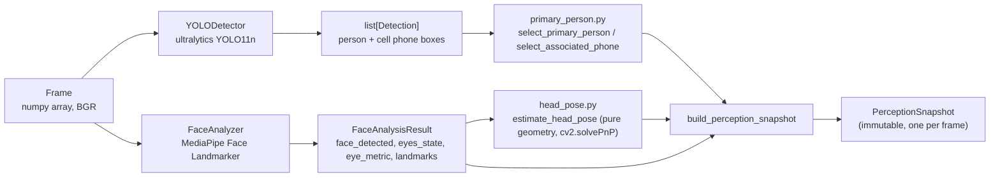

# The Computer-Vision Pipeline

## Simple explanation

Every frame from the webcam goes through two separate AI models — one that finds
people and phones (YOLO), one that finds your face and 468 points on it (MediaPipe) —
plus a small amount of hand-written geometry to turn those face points into "are your
eyes open" and "which way is your head turned". None of these three things know about
each other; a fourth piece of plain Python combines their outputs into one snapshot.

## Pipeline stages

### 1. Camera → Frame

`CameraManager.read_frame()` returns a `Frame(image, timestamp, index)` — `image` is a
raw BGR `numpy.ndarray` from OpenCV, `timestamp` is `time.monotonic()` at capture time
(never wall-clock — see [`TEMPORAL_FILTERING.md`](TEMPORAL_FILTERING.md) for why that
matters everywhere downstream).

### 2. YOLO — person & cell-phone detection

`YOLODetector.detect(image, timestamp)` runs Ultralytics YOLO11n and returns a plain
`list[Detection]` filtered to exactly two classes: `"person"` and `"cell phone"`
(`PERSON_CLASS_NAME`, `CELL_PHONE_CLASS_NAME` in `src/detection/yolo_detector.py`),
each above its own confidence threshold (`yolo.confidence`, `yolo.phone_confidence`).
Device selection (`auto`/`cpu`/`cuda`) is resolved once at construction, with automatic
CPU fallback if CUDA isn't available.

### 3. Primary-person selection & phone association

`src/detection/primary_person.py` is two **pure functions**, no model, no state:

- `select_primary_person(detections)` — largest-area `"person"` box wins (PRD §8: "do
  not implement complex multi-person tracking").
- `select_associated_phone(detections, primary_person)` — a phone whose box-center
  falls inside the primary person's box is preferred; if none does, the
  highest-confidence phone detection anywhere in frame is still used as a fallback —
  **a missed spatial association never suppresses a real phone-distraction signal.**

### 4. MediaPipe — face landmarks & eye state

`FaceAnalyzer.analyze(image, timestamp)` runs MediaPipe's Face Landmarker (up to one
face) and computes eye-openness via **Eye Aspect Ratio (EAR)** from the landmark
geometry (`src/face/eye_metrics.py`), then classifies `EyeState.OPEN` / `CLOSED` /
`UNKNOWN` using **hysteresis** (a dead zone between `eyes.closed_threshold` and
`eyes.open_threshold` — a metric sitting between the two keeps whatever the previous
state was, so noise right at the boundary can't flicker the classification every
frame). If no face is found, `face_detected=False` and `eyes_state=UNKNOWN` —
**never `CLOSED`** (a hard PRD rule: missing data must never be interpreted as the
worst-case reading).

### 5. Head pose — pure geometry, no model

`src/face/head_pose.py`'s `estimate_head_pose()` is a **pure function**, not a model —
it takes six specific landmark points MediaPipe already produced (nose tip, chin, both
eye outer corners, both mouth corners) and solves for an approximate 3D rotation via
`cv2.solvePnP` against a generic reference face, then classifies the yaw/pitch against
`head.yaw_threshold_degrees` / `head.pitch_threshold_degrees` into `CENTER` / `LEFT` /
`RIGHT` / `UP` / `DOWN` / `UNKNOWN`. This reuses the *same* MediaPipe inference pass
`FaceAnalyzer` already ran — no second model call.

### 6. The snapshot

`build_perception_snapshot()` (`src/core/types.py`) is the single assembly point,
producing an immutable `PerceptionSnapshot` with every field a downstream consumer
needs: `person_present`, `primary_person`, `phone_detected`, `phone_confidence`,
`face_present`, `eyes_state`, `eye_metric`, `head_orientation`, `head_yaw`,
`head_pitch`, and a derived `VisionQuality` (`GOOD` / `DEGRADED` / `NO_PERSON` — see
[`STATE_MACHINE.md`](STATE_MACHINE.md) for exactly how this drives `UNKNOWN` vs.
`AWAY`).

## Why raw per-frame detection is noisy

None of the above is filtered over time yet. A single frame can be wrong for entirely
mundane reasons: motion blur, a hand briefly occluding the phone, a blink registering
as a momentary "closed" reading, MediaPipe losing the face for one frame as you turn
your head, YOLO's confidence dipping below threshold for one frame in bad lighting.
**Nothing in this document's pipeline should ever be trusted as "the truth" on its
own** — that's exactly what the next layer, [`TEMPORAL_FILTERING.md`](TEMPORAL_FILTERING.md),
exists to fix. The CV pipeline's job stops at "here is what one frame looked like."

## What runs every frame vs. what's throttled

| Stage | Frequency |
|---|---|
| Camera read | Every frame |
| Face analysis (MediaPipe) | **Every frame, always** — PRD's main-loop diagram never qualifies this stage, and eye/drowsiness timing needs frame-accurate data |
| Head pose | Every frame face+landmarks are present (near-zero cost — reuses existing landmarks) |
| YOLO detection | **Throttled** — at most once per `yolo.detection_interval_seconds` (default `0.1s`); frames in between reuse the last detection result |
| Temporal filters, state evaluation, events, session recording | Every frame `_process_frame` runs, regardless of whether YOLO ran that frame |

## CPU performance implications

Real measurement (CPU-only, no GPU, on the development machine — see
[`PERFORMANCE.md`](PERFORMANCE.md) for the full numbers): YOLO inference costs roughly
50–70ms per call, MediaPipe face analysis roughly 5–17ms per call. Running YOLO on
every frame capped throughput at **~11 fps**, well under the PRD's 20–30 fps target.
Throttling YOLO to once per 0.1s (while face analysis kept running every frame)
measured at **~26.5 fps** on the same hardware — landing inside the target range. This
is the concrete reason YOLO specifically (not face analysis) is the throttled stage:
it's the dominant cost, and the PRD explicitly permits reusing its last result.

## Error handling in this stage

- `YOLODetector.detect()` raising an exception mid-frame is caught by
  `FocusGuardApp._process_frame()`, logged as a `MODEL_ERROR` event, and that frame's
  detections degrade to an empty list — never crashes the session.
- `FaceAnalyzer.analyze()` raising is caught the same way, logged as `VISION_ERROR`,
  and degrades to `face_detected=False` / `eyes_state=UNKNOWN` for that frame.
- Model *loading* failures (`YOLODetector.load()`, `FaceAnalyzer.load()`) are treated
  differently: these happen once at startup and are **fatal** — a missing/corrupt model
  file stops the app with a readable message rather than trying to run a broken
  pipeline. See [`SYSTEM_FLOW.md`](SYSTEM_FLOW.md#error-handling-in-the-flow-prd-35).

## YOLO vs. MediaPipe vs. custom Python — who does what

| | YOLO11n | MediaPipe Face Landmarker | Custom Python |
|---|---|---|---|
| What it is | Pretrained object-detection model (Ultralytics) | Pretrained face-landmark model (Google) | Hand-written logic |
| Used for | Person + cell-phone bounding boxes | 468 facial landmark points | Everything else |
| Examples | `YOLODetector.detect()` | `FaceAnalyzer.analyze()` | EAR calculation, hysteresis, head-pose `solvePnP` math, primary-person selection, phone association, all temporal filtering, the state machine, events, audio, session analytics |
| Trained/fine-tuned by this project? | No — off-the-shelf weights | No — off-the-shelf weights | N/A (not a model) |
