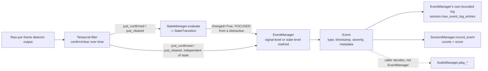

# The Event System

Source: `src/events/event_manager.py`. `EventManager` owns exactly one job: turning
already-decided transition edges into immutable `Event` records and keeping a bounded,
timestamp-ordered log. It never decides *whether* something happened — every method on
it corresponds to one specific, already-confirmed transition, so it cannot generate an
event from single-frame noise by construction.

## The full pipeline

`EventManager` does not call `AudioManager` or `SessionManager` itself — it just
produces `Event` objects. `FocusGuardApp._emit_and_route_events()` is the one place
that decides what to *do* with each event (record it, play a sound, or both).

## Every event type (PRD §20)

| `EventType` | Severity | Fired from | Fires on |
|---|---|---|---|
| `SESSION_STARTED` | INFO | `_start_session()` | Every session start |
| `SESSION_ENDED` | INFO | `_end_session()` | Every session end |
| `PHONE_DETECTED` | WARNING | `PhoneTemporalFilter.just_confirmed` | Phone confirmed (cooldown-gated, see below) |
| `PHONE_CLEARED` | INFO | `PhoneTemporalFilter.just_cleared` | Phone distraction clears |
| `DROWSINESS_SIGNAL` | WARNING | `DrowsinessFilter.just_confirmed` | Sustained eye closure confirmed |
| `DROWSINESS_CLEARED` | INFO | `DrowsinessFilter.just_cleared` | Eyes reopen after a confirmed drowsiness signal |
| `ATTENTION_DIVERTED` | WARNING | `HeadOrientationFilter.just_diverted` | Sustained off-center head confirmed |
| `ATTENTION_RESTORED` | INFO | `HeadOrientationFilter.just_restored` | Head returns to center |
| `PERSON_LEFT` | WARNING | `PersonAwayFilter.just_confirmed` | Absence confirmed (→ `AWAY`) |
| `PERSON_RETURNED` | INFO | `PersonAwayFilter.just_cleared` | Person returns after a confirmed absence |
| `FOCUS_RESTORED` | INFO | `StateTransition` (state-level) | Returning to `FOCUSED` from an actual distraction state — see below |
| `CAMERA_ERROR` | ERROR | camera read failure | Non-fatal read errors during an active session |
| `MODEL_ERROR` | ERROR | YOLO inference exception | A single frame's detection failing |
| `VISION_ERROR` | ERROR | face-analysis exception | A single frame's face analysis failing |

## Signal-level vs. state-level events

- **Signal-level** (`PHONE_DETECTED`/`CLEARED`, `DROWSINESS_SIGNAL`/`CLEARED`,
  `ATTENTION_DIVERTED`/`RESTORED`, `PERSON_LEFT`/`RETURNED`) — one per filter's own
  confirm/clear edge, independent of what `FocusState` ends up being.
- **State-level** (`FOCUS_RESTORED`, `SESSION_STARTED`/`ENDED`) — one per
  `StateManager`/session-lifecycle transition.

### `FOCUS_RESTORED` — the one non-trivial rule

`FOCUS_RESTORED` only fires when `StateTransition.changed` is `True`, the new state is
`FOCUSED`, **and** the previous state was an actual distraction state
(`PHONE_DISTRACTION`, `DROWSINESS_SIGNAL`, `ATTENTION_DIVERTED`, or `AWAY`) — not `IDLE`
and not `UNKNOWN`. This was found and fixed during implementation: without excluding
`UNKNOWN`, simply sitting down already-focused at the very start of a session (whose
first evaluated state is always `UNKNOWN`, see [`STATE_MACHINE.md`](STATE_MACHINE.md))
would spuriously fire "focus restored" before any real distraction ever happened — the
PRD's own demo script (§38) only expects this event after a genuine distraction clears
("put phone away" → "FOCUS RESTORED").

## Why events must not be generated every frame

`EventManager`'s methods each correspond to exactly one filter's `just_confirmed` /
`just_cleared` edge (a boolean that is only ever `True` on the single frame a
transition genuinely happens) — so simply never being called except on those edges is
what guarantees "no repeated event for an unchanged state", satisfying PRD §36's
explicit requirement ("the same event cannot repeatedly trigger audio/event every
frame") structurally, without any extra bookkeeping needed for most event types.

## Cooldown — the one exception

`PHONE_DETECTED` is the **only** event type with a configured cooldown
(`phone.warning_cooldown_seconds`, default `10s`), reusing the generic `Cooldown`
primitive from `src/state/temporal_filter.py`. Why only this one: it's the only PRD-defined
cooldown value anywhere in the config schema, and every other event type's
"no repeat while unchanged" guarantee already comes for free from only ever firing on a
genuine transition edge. A phone that rapidly confirms → clears → reconfirms in quick
succession *would* generate multiple legitimate `just_confirmed` edges — the cooldown
exists specifically to stop that specific oscillation from spamming the event log (and,
downstream, the audio warning) even though each individual edge is technically real.
Suppression happens only at the **event/log level** — the underlying
`PhoneTemporalFilter`/`StateManager` state updates normally either way.

## Bounded log

`session.max_event_log_entries` (default `100`) caps `EventManager`'s own in-memory
log — oldest entries are silently dropped once the cap is exceeded, so the on-screen
"EVENT LOG" panel and the log itself never grow unbounded during a very long session.
This is a *different* list from `SessionManager`'s own event history — see
[`SESSION_ANALYTICS.md`](SESSION_ANALYTICS.md) for why that one is intentionally
unbounded.

## What each event type affects downstream

| Event type | Event log | `SessionManager` count | Focus score | Audio |
|---|---|---|---|---|
| `PHONE_DETECTED` | ✅ | `phone_distraction_count` +1 | −`score.phone_event_penalty` | `play_phone_warning()` (+ persistent reminders while it stays confirmed) |
| `DROWSINESS_SIGNAL` | ✅ | `drowsiness_count` +1 | −`score.drowsiness_event_penalty` | `play_drowsiness_warning()` (+ persistent reminders) |
| `ATTENTION_DIVERTED` | ✅ | `attention_diversion_count` +1 | −`score.attention_event_penalty` | `play_attention_warning()` (+ persistent reminders) |
| `PERSON_LEFT` | ✅ | `away_count` +1 | −`score.away_event_penalty` | *(none — no away sound exists)* |
| `FOCUS_RESTORED` | ✅ | recorded, no dedicated counter | no change | `play_focus_restored()` |
| `PHONE_CLEARED` / `DROWSINESS_CLEARED` / `ATTENTION_RESTORED` / `PERSON_RETURNED` | ✅ | recorded, no dedicated counter | no change | no dedicated sound |
| `SESSION_STARTED` / `SESSION_ENDED` | ✅ | recorded | no change | `SESSION_ENDED` triggers `play_session_complete()` (via `_end_session()`, not the event itself) |
| `CAMERA_ERROR` / `MODEL_ERROR` / `VISION_ERROR` | ✅ | recorded | no change | none |

Only four event types affect the numeric score: `PHONE_DETECTED`, `DROWSINESS_SIGNAL`,
`ATTENTION_DIVERTED`, `PERSON_LEFT` — matching `ScoreConfig`'s exactly four penalty
fields (`src/core/config_manager.py`). See [`SESSION_ANALYTICS.md`](SESSION_ANALYTICS.md)
for exactly how `SessionManager.record_event()` applies these.
