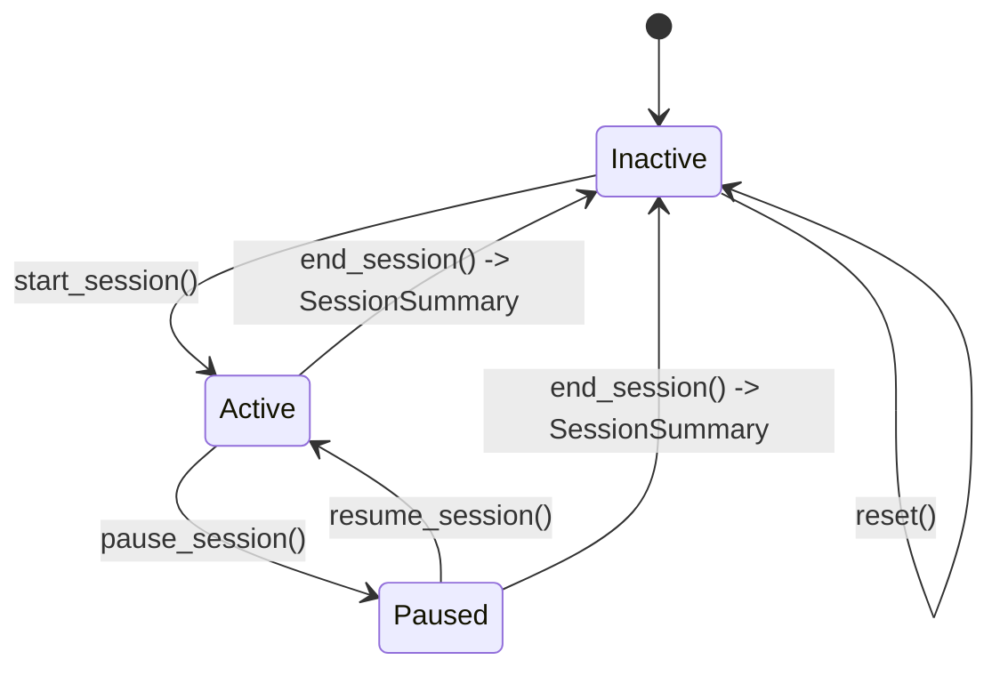

# Session Analytics

Source: `src/session/session_manager.py`. `SessionManager` owns *only* session
statistics and persistence (PRD §33) — duration/streak/count accumulation and a
demonstration focus score, computed from incrementally-fed `StateTransition` and
`Event` objects. It's the one manager that legitimately imports `FocusState` and
`EventType` (see [`ARCHITECTURE.md`](ARCHITECTURE.md) for why that's a deliberate
exception, not an inconsistency).

## Session lifecycle

| Method | What it does |
|---|---|
| `start_session(timestamp)` | Resets all counters to zero, `focus_score = starting_score`. Idempotent — a no-op if already active. |
| `pause_session(timestamp)` | Credits the interval up to `timestamp` to whatever state was active, then stops the accounting clock. No-op if not active or already paused. |
| `resume_session(timestamp)` | Resets the accounting clock's origin to `timestamp` — **the paused wall-clock gap is excluded from every duration total.** No-op if not active or not paused. |
| `end_session(timestamp)` | Final accounting pass (if not already paused), returns a `SessionSummary`. Raises `SessionError` if no session is active. |
| `reset()` | Unconditional full reset back to a blank slate — no "is this safe" check at this level (that policy lives in `FocusGuardApp`, which only calls `R` while paused/idle — PRD §23). |



## The push model: `record_transition()` / `record_event()`

`SessionManager` doesn't poll anything — it's fed incrementally, matching PRD §34's
exact main-loop step order ("...evaluate state → generate events → ... → update
session..."):

- `record_transition(transition)` — called **every evaluated frame**, not just on
  `changed=True` edges. Most calls carry no state change but still carry real elapsed
  time that must be counted.
- `record_event(event)` — called for each `Event` `EventManager` actually emits.

Both **defensively no-op** while the session is inactive or paused (rather than
raising) — a safety net independent of caller discipline.

## Duration accounting: how time gets credited between transitions

This is the one genuinely subtle piece of the whole codebase, so it's worth a careful
example. The rule: on every `record_transition(transition)` call, the interval
`[last_call_timestamp, this_call_timestamp)` is credited to **whichever state was
active during that interval** — i.e. `self._last_state`, the state *as of the previous
call*, not the new one just reported. Only after crediting does `_last_state` update to
the new state.

### Worked timeline (from the project's own test suite, `test_realistic_full_session_scenario`)

```text
t=0     seed: FOCUSED
t=100   -> PHONE_DISTRACTION     credits [0, 100)   to FOCUSED           (+100 focused)
t=120   -> FOCUSED               credits [100, 120) to PHONE_DISTRACTION (+20 phone)
t=170   -> DROWSINESS_SIGNAL     credits [120, 170) to FOCUSED           (+50 focused)
t=171   -> FOCUSED               credits [170, 171) to DROWSINESS_SIGNAL (not duration-tracked)
t=201   -> AWAY                  credits [171, 201) to FOCUSED           (+30 focused)
t=211   -> FOCUSED               credits [201, 211) to AWAY              (not duration-tracked)
end at t=216                     credits [211, 216) to FOCUSED           (+5 focused)

Result:
  total_duration_seconds          = 216
  focused_duration_seconds        = 100 + 50 + 30 + 5 = 185
  phone_distraction_duration_seconds = 20
  longest_focus_streak_seconds    = max(100, 50, 30, 5) = 100
```

Only `FOCUSED` and `PHONE_DISTRACTION` have a duration **bucket** — matching PRD §25's
exact tracked list ("focused duration", "phone distraction duration/count"). `AWAY` and
`DROWSINESS_SIGNAL`/`ATTENTION_DIVERTED` have **counts** but not accumulated durations —
this isn't an oversight, it's what the PRD actually asks for.

### Longest focus streak

A running "current streak" accumulates alongside `focused_duration_seconds` and resets
to zero the instant the credited state isn't `FOCUSED`; `longest_focus_streak_seconds`
is simply the maximum the running streak ever reached. In the example above: streak 1 =
100s (then reset by the phone distraction), streak 2 = 50s (reset by drowsiness),
streak 3 = 30s (reset by away), streak 4 = 5s (session ends) → longest = 100s.

## Pause correctness

If a session pauses and later resumes after a huge real-world gap, that gap must
**never** be silently credited to whatever state was active before pausing. This is
handled by `resume_session()` resetting the accounting clock's origin to the resume
timestamp — the same fix `_PersistentReminder` in `AudioManager` independently needed
and got, for exactly the same reason (see [`AUDIO_SYSTEM.md`](AUDIO_SYSTEM.md)).

## Counts and the focus score

`record_event()` increments a counter and applies a score penalty for **exactly four**
event types — matching `ScoreConfig`'s four penalty fields precisely:

| Event | Counter | Penalty (default) |
|---|---|---|
| `PHONE_DETECTED` | `phone_distraction_count` | `score.phone_event_penalty` = 10 |
| `DROWSINESS_SIGNAL` | `drowsiness_count` | `score.drowsiness_event_penalty` = 5 |
| `ATTENTION_DIVERTED` | `attention_diversion_count` | `score.attention_event_penalty` = 3 |
| `PERSON_LEFT` | `away_count` | `score.away_event_penalty` = 5 |

Every other event type is still appended to `SessionManager`'s own event list (for the
JSON summary) but does not affect counts or score. The score starts at
`score.starting_score` (default 100) and is clamped at a minimum of `0` — it can never
go negative, no matter how many penalties accumulate.

## Why `SessionManager`'s event list is unbounded (unlike `EventManager`'s)

`EventManager`'s own log is capped at `session.max_event_log_entries` (a *display*
concern — the on-screen panel only needs the latest N). `SessionManager` keeps its
**own, separate, unbounded** copy of every event, because the JSON summary must be
accurate for the *entire* session — deriving it from `EventManager`'s bounded log would
silently lose early events in any session long enough to exceed the cap. For realistic
study-session lengths (tens of events per hour) this is not a meaningful memory
concern; see [`PERFORMANCE.md`](PERFORMANCE.md) for measured evidence that the
orchestration layer as a whole does not leak memory over very long synthetic sessions.

## JSON persistence

`SessionManager.save_summary_json(summary, directory=None)` is a `@staticmethod`
(needs no instance state) that writes `logs/session_YYYYMMDD_HHMMSS.json` — the
filename uses the session's **start** wall-clock time (`datetime.now()` captured once
at `start_session()`), never derived from the monotonic timestamps used for all
duration math. `directory` defaults to `PROJECT_ROOT/logs` but is overridable (used
exclusively by tests, which always redirect it to a temporary directory — the real
`logs/` folder is never touched by the test suite). See
[`ARCHITECTURE.md`](ARCHITECTURE.md#implementation-vs-documentation-notes) (row 5) for
the one documented discrepancy here: the PRD calls JSON persistence "optional," but
`FocusGuardApp._end_session()` currently calls it unconditionally on every session end.

## Future idea: a productivity report (NOT IMPLEMENTED)

> **This section describes a possible future direction only. Nothing described below
> exists in the codebase today.** No parent/guardian view, no report generation, no
> multi-session aggregation, and no user-facing "report" concept of any kind currently
> exist anywhere in FocusGuard.

The data `SessionSummary` already captures — total duration, focused duration, per-type
distraction counts, longest streak, and the estimated focus score, all timestamped and
JSON-persisted per session — is structurally the right *shape* of data a future
"productivity report" feature (e.g. summarizing a study session for a parent or
guardian) would need as its input. Because each session already writes an independent,
self-contained JSON file to `logs/`, a hypothetical future report generator could in
principle read a directory of these files and aggregate across sessions without needing
any change to `SessionManager` itself. **This is speculation about a possible future
extension, not a plan, a commitment, or a partially-built feature** — it is included
here only because the documentation task explicitly asked for this connection to be
drawn while being unambiguous about its status.
