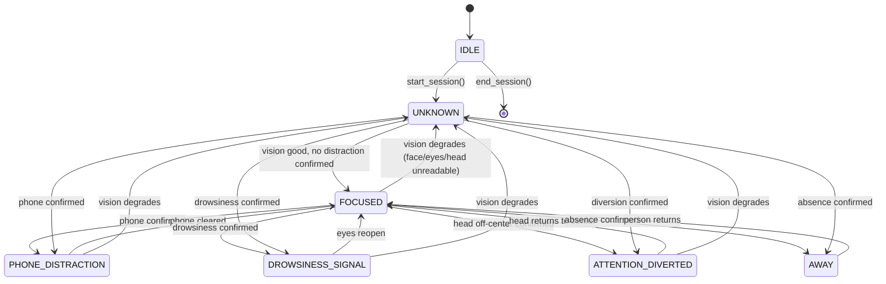

# The Focus State Machine

Source: `src/state/state_manager.py`. This is the single place in the codebase that
decides "what is the user's status right now" — and it is deliberately the *only*
place that decides it.

## The states

| `FocusState` | Meaning | Set by |
|---|---|---|
| `IDLE` | No active session (PRD §17) | `StateManager.__init__` / `end_session()` |
| `UNKNOWN` | A person is present but required face-derived perception (eyes/head) is unavailable right now | `evaluate()`, or immediately after `start_session()` |
| `FOCUSED` | Person present, no confirmed distraction, vision quality is good | `evaluate()` (the "else" branch — see below) |
| `PHONE_DISTRACTION` | Phone confirmed by `PhoneTemporalFilter` | `evaluate()` |
| `DROWSINESS_SIGNAL` | Sustained eye closure confirmed by `DrowsinessFilter` | `evaluate()` |
| `ATTENTION_DIVERTED` | Sustained off-center head orientation confirmed by `HeadOrientationFilter` | `evaluate()` |
| `AWAY` | Sustained person absence confirmed by `PersonAwayFilter` | `evaluate()` |

`StateManager` never inspects raw detector output — it only ever receives four
already-confirmed booleans (`is_away`, `is_phone_distraction`, `is_drowsy`,
`is_diverted`) plus a `VisionQuality` enum. This is why it cannot flap on single-frame
noise "by construction" — that guarantee lives entirely upstream, in the temporal
filters (see [`TEMPORAL_FILTERING.md`](TEMPORAL_FILTERING.md)).

## Priority order (PRD §18) — why it matters

```text
AWAY > PHONE_DISTRACTION > DROWSINESS_SIGNAL > ATTENTION_DIVERTED > FOCUSED > UNKNOWN
```

Priority matters because in a real frame, **more than one condition can be true
simultaneously** — the exact `evaluate()` logic is a strict `elif` chain, so it is
deterministic by construction: whichever condition appears earliest in the chain wins,
every time, with no ambiguity.

### Concrete example: phone + looking away simultaneously

If `is_phone_distraction=True` **and** `is_diverted=True` in the same frame (you're
holding your phone up and also turned away from the camera), the code is:

```python
elif is_phone_distraction:
    new_state = FocusState.PHONE_DISTRACTION
elif is_drowsy:
    ...
elif is_diverted:
    new_state = FocusState.ATTENTION_DIVERTED
```

`PHONE_DISTRACTION` is checked *before* `is_diverted`, so **`PHONE_DISTRACTION`
wins**. The reasoning (from the module docstring and PRD §36's own test list, which
explicitly requires `phone + drowsiness → PHONE_DISTRACTION`): a phone in hand is
judged the more actionable, more severe distraction to surface to the user — showing
"attention diverted" while a confirmed phone distraction is *also* happening would bury
the more important signal. The same reasoning extends up the chain: `AWAY` outranks
everything (if the person isn't even there, nothing else is meaningful), and
`PHONE_DISTRACTION` outranks both `DROWSINESS_SIGNAL` and `ATTENTION_DIVERTED`.

## The state diagram



(Every state can transition to any other reachable state on the very next `evaluate()`
call — this diagram shows the meaningful ones; the actual rule is simply "recompute the
priority chain fresh every frame", not a fixed adjacency list.)

## `UNKNOWN` vs. `AWAY` — the one subtle rule

This is a deliberate design decision worth stating explicitly, because it's easy to get
backwards: **a *missing* person means `AWAY` (once confirmed), never `UNKNOWN`.**
`UNKNOWN` is reserved specifically for "a person **is** present, but we can't read
their face/eyes/head reliably right now" (`VisionQuality.DEGRADED`). This is enforced
by `PerceptionSnapshot`'s `VisionQuality` computation (`src/core/types.py`):

```python
if not person_present:
    return VisionQuality.NO_PERSON      # -> drives toward AWAY, never UNKNOWN
if not face_present or eyes_state == UNKNOWN or head_orientation == UNKNOWN:
    return VisionQuality.DEGRADED       # -> the only case that drives UNKNOWN
return VisionQuality.GOOD
```

There's a further subtlety for the *grace period* before `AWAY` actually confirms
(`person.away_duration_seconds`, default 3s): during that window, `PersonAwayFilter`
hasn't confirmed yet, so `is_away=False`, but `VisionQuality` is already `NO_PERSON`.
`StateManager.evaluate()` handles this by **holding the previous state** rather than
flapping into `UNKNOWN`:

```python
elif vision_quality == VisionQuality.NO_PERSON:
    new_state = previous  # unconfirmed absence: nothing visibly changes yet
```

This directly implements PRD §14's "no AWAY event if the person returns before the
threshold" at the state-machine level — the dashboard keeps showing whatever it showed
before the person stepped out, and only flips to `AWAY` once the filter actually
confirms.

## Why `IDLE` → `UNKNOWN`, never straight to `FOCUSED`

`StateManager.start_session()` always lands on `UNKNOWN`, never `FOCUSED` — even if the
very first frame would otherwise look perfectly fine. This is deliberate: no perception
has been evaluated yet at the instant a session starts, so the state machine must never
*assume* focus. The first real `evaluate()` call (using the first frame's actual
signals) is what can promote it to `FOCUSED`.

## No repeated state-change signaling

`evaluate()` returns a `StateTransition(previous_state, state, changed, timestamp)` on
every call, including calls where nothing changed (`changed=False`). Downstream
consumers (`SessionManager`, event generation) rely on `changed` to avoid re-acting to
an unchanged state every single frame — see [`EVENT_SYSTEM.md`](EVENT_SYSTEM.md).
