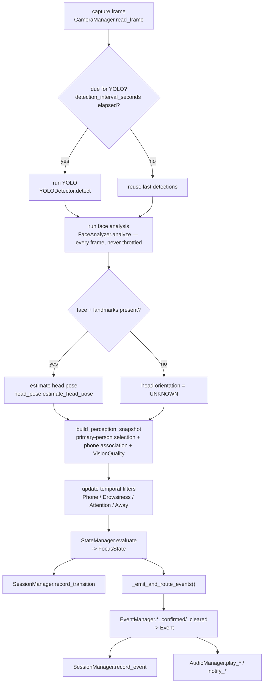
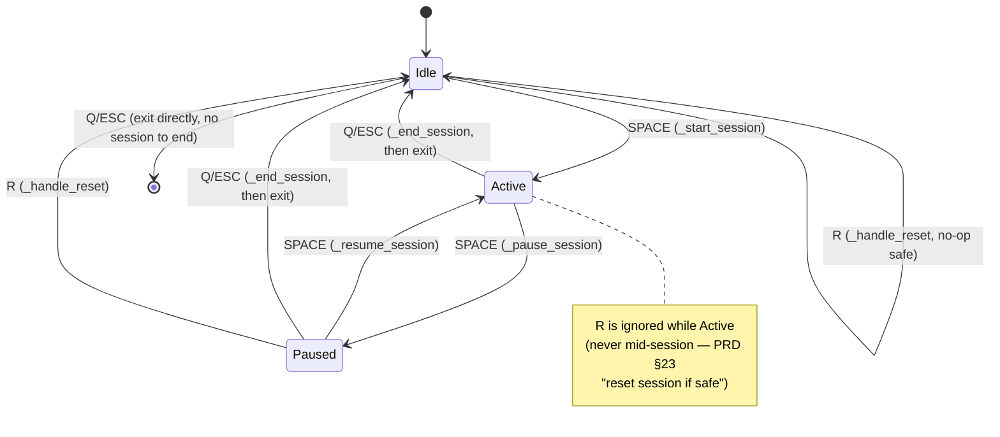

# System Flow: The Complete Runtime Lifecycle

Everything in this document is a direct description of `src/core/app.py`'s
`FocusGuardApp` class — the single orchestrator. Line-level method names are cited so
you can cross-reference directly.

## Simple explanation

You run `python main.py`. It loads your settings, opens a window, turns on your
webcam, loads two AI models, and then — once you press `SPACE` — starts reading your
webcam 10–25 times a second, checking each frame for a person, a phone, your eyes, and
your head position, deciding a single status ("focused", "on your phone", etc.),
playing a sound if needed, updating a running score, and drawing all of it to the
window. When you press `Q`, it stops, prints a summary, and saves it to a file.

## Technical explanation: launch to shutdown

```mermaid
sequenceDiagram
    participant Main as main.py
    participant App as FocusGuardApp
    participant Cfg as ConfigManager
    participant UI as UIManager
    participant Cam as CameraManager
    participant Yolo as YOLODetector
    participant Face as FaceAnalyzer
    participant Audio as AudioManager

    Main->>Cfg: ConfigManager().load()
    Cfg-->>Main: AppConfig (or ConfigError -> exit 1)
    Main->>App: FocusGuardApp(config)
    Main->>App: run()
    App->>App: _startup()
    App->>UI: init()  (Pygame window)
    App->>Cam: open()  (webcam)
    App->>Yolo: load()  (YOLO11n weights)
    App->>Face: load()  (MediaPipe Face Landmarker)
    App->>Audio: init()  (best-effort; failure logged, never fatal)
    Note over App: any of UI/Cam/Yolo/Face raising = fatal,<br/>readable message printed, exit 1
    App->>App: _main_loop() : while self._running
    loop every frame
        App->>Cam: read_frame()
        App->>UI: poll_input()
        App->>App: _handle_actions(actions)
        alt session active and not paused
            App->>App: _process_frame(frame)
        end
        App->>App: _build_dashboard_view(frame)
        App->>UI: render(view, frame.image)
        App->>App: _track_fps(frame.timestamp)
    end
    App->>App: _shutdown()
    App->>Cam: release()
    App->>Audio: shutdown()
    App->>UI: shutdown()
```

## The exact order inside one frame (`_process_frame`, PRD §34)

This is the literal step order in `FocusGuardApp._process_frame()`:



Note the one explicit conditional: **YOLO is the only stage that can be skipped on a
given frame.** Face analysis, filter updates, state evaluation, event generation, and
session recording all run on every single frame that `_process_frame` is called on.
See [`CV_PIPELINE.md`](CV_PIPELINE.md) for why.

## Session lifecycle (controls, PRD §23)



What each transition actually does (all in `src/core/app.py`):

| Trigger | Method | What happens |
|---|---|---|
| `SPACE` from idle | `_start_session()` | `StateManager.start_session()` (IDLE→UNKNOWN), `SessionManager.start_session()`, clears all per-session frame state, emits `SESSION_STARTED`, starts background music if enabled. |
| `SPACE` while active | `_pause_session()` | `SessionManager.pause_session()` (freezes duration accounting), pauses music, resets persistent audio-reminder timers. |
| `SPACE` while paused | `_resume_session()` | `SessionManager.resume_session()` (resets the accounting clock's origin to *now*, excluding the paused gap), resumes music. |
| `Q`/`ESC` while active/paused | `_handle_exit()` → `_end_session()` | Emits `SESSION_ENDED`, computes and prints the `SessionSummary`, stops music, plays the session-complete sound, resets audio reminders, saves JSON, then exits. |
| `Q`/`ESC` while idle | `_handle_exit()` | Exits directly — no session to end. |
| `R` while paused/idle | `_handle_reset()` | `SessionManager.reset()`, `StateManager.end_session()`, stops music, resets audio reminders, clears per-session frame state. |
| `R` while active | `_handle_reset()` | No-op (explicit early return) — never allowed to silently discard an in-progress session. |
| `M` (any time) | `_handle_actions` | `AudioManager.toggle_mute()`. |
| `D` (any time) | `_handle_actions` | Flips the local `_debug` flag (drives the debug overlay in the next render). |

## What runs even while paused/idle

`_run_one_iteration()` **always** reads a frame, polls input, and renders — even before
a session ever starts or while paused. Only `_process_frame()` (the CV pipeline itself)
is gated on `session.is_active and not session.is_paused`. This is why the camera
preview is live in IDLE (PRD §5's "show camera preview" step) and why pausing keeps the
window responsive instead of freezing it.

## Error handling in the flow (PRD §35)

| Failure point | Behavior |
|---|---|
| `UI.init()`, `Camera.open()`, `Yolo.load()`, `Face.load()` raise | Caught in `run()`, printed as `"Fatal startup error: ..."`, `_shutdown()` still runs (safe even on partial startup), process exits with code `1`. |
| `Audio.init()` raises | Caught inside `_startup()` specifically, printed as `"Audio unavailable, continuing without sound: ..."`, **not fatal** — the app continues without sound. |
| `Camera.read_frame()` raises mid-loop | `_handle_camera_error()`: prints a readable message, emits a `CAMERA_ERROR` event if a session is active, sets `_running = False` (clean stop — no retry loop). |
| `YOLODetector.detect()` raises mid-frame | Caught inside `_process_frame()`, emits `MODEL_ERROR`, degrades that single frame to "no detections", continues. |
| `FaceAnalyzer.analyze()` raises mid-frame | Caught inside `_process_frame()`, emits `VISION_ERROR`, degrades that single frame to "no face detected", continues. |
| Any other unexpected exception in the main loop | Caught by `run()`'s outermost `except Exception`, printed as `"Unexpected runtime error: ..."`, exit code `1`. `_shutdown()` still runs via `finally`. |
| Session-summary JSON write fails (`OSError`) | Caught in `_end_session()`, printed as `"Could not save session summary: ..."`, session end otherwise completes normally. |

See [`CV_PIPELINE.md`](CV_PIPELINE.md) and the error-handling diagram in
[`docs/diagrams/runtime-flow.md`](diagrams/runtime-flow.md) for more detail.
